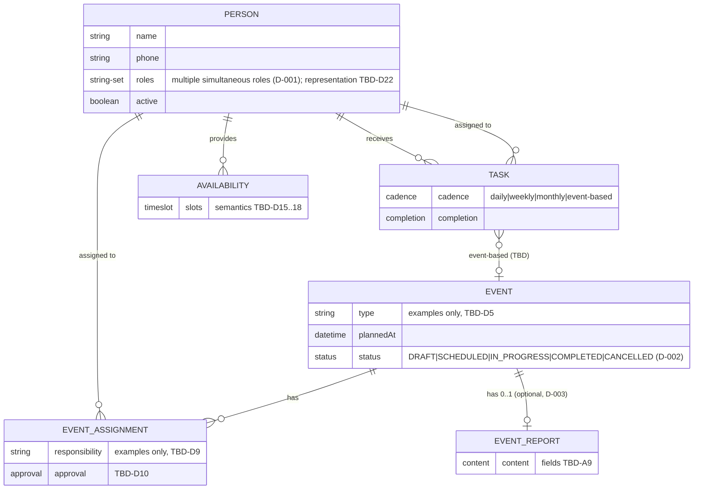

# 02 — Domain & Data Model Foundation

**Project:** Ketabdaneh
**Document status:** Conceptual model — three initial MVP decisions approved (§1.1); remaining TBDs pending review.
**Last reviewed:** 2026-09-09
**Depends on:** [00-PROJECT-CONTEXT.md](00-PROJECT-CONTEXT.md), [01-ARCHITECTURE.md](01-ARCHITECTURE.md)

---

## 1. Purpose

Translate the currently **known** Ketabdaneh branch concepts into a clear
initial domain/data model foundation, so that:

- Everyone shares one vocabulary for the core entities.
- Database schema, API, and UI work can later be built against an approved model.
- The boundary between *confirmed knowledge* and *assumption* stays explicit.

> **Modeling rule for this document:** no business rule is invented. Anything
> not confirmed in discovery or approved as a decision is marked **TBD** and
> must be resolved with the branch manager/domain experts before the
> corresponding piece is implemented. TBD identifiers here extend the A-series
> from [00-PROJECT-CONTEXT.md](00-PROJECT-CONTEXT.md) §7.

## 1.1 Approved Decisions (MVP)

The following decisions have been **explicitly approved** for the current MVP.
They are final for now and may be revisited later if the real business
requires it.

| ID | Decision |
| --- | --- |
| **D-001** | A Person **may hold multiple permanent organizational roles simultaneously**. |
| **D-002** | The initial Event status set is exactly: **DRAFT, SCHEDULED, IN_PROGRESS, COMPLETED, CANCELLED**. |
| **D-003** | EventReport is **optional**: an Event has **zero or one** EventReport. A completed Event may have a report, but a report is not mandatory. |

These are the only approved domain decisions so far. Everything not covered
by them remains TBD (§7).

---

## 2. Core Entities

### 2.1 Person

A human member of the branch.

**Known conceptual attributes** (examples of known concepts — not a final field list):

| Concept | Notes |
| --- | --- |
| Name | Known concept. Exact format (single field vs. first/last) **TBD-D1**. |
| Phone | Known concept. Uniqueness rules **TBD-D2**. |
| Role(s) | Which role(s) the person holds (see §3). **Approved (D-001):** a Person may hold multiple roles simultaneously. |
| Active/inactive state | Known concept: a person can be active or inactive. Exact semantics (e.g., can an inactive person appear in new assignments?) **TBD-D3**. |

**Constraints / open questions:**

- **[RESOLVED — D-001]** One Person **may hold multiple roles simultaneously**
  (approved MVP decision). The data representation of roles — enum, JSON,
  join table, or other — is a **later schema decision** and remains
  **TBD-D22**.
- No role-transition rules exist (e.g., learner → supporter) → **TBD-D4**.
  Do not invent any.

### 2.2 Event

An activity of the branch, planned in advance — commonly for the following week.

**Known conceptual attributes:**

| Concept | Notes |
| --- | --- |
| Type/category | Known examples: introduction/orientation session, film analysis, book analysis, gathering, group games, class. The list is **not final** — a closed taxonomy is **TBD-D5**. |
| Planned date/time | Known concept (scheduled in advance, usually weekly). Whether events repeat/recurrence is modeled natively or as separate instances is **TBD-D6**. |
| Status | **Approved (D-002)** initial status set: `DRAFT`, `SCHEDULED`, `IN_PROGRESS`, `COMPLETED`, `CANCELLED` (see below). |
| People assigned to responsibilities | Via EventAssignment (see §2.3). |

**Status lifecycle (approved initial concept — D-002):**

```text
DRAFT → SCHEDULED → IN_PROGRESS → COMPLETED
                 └──────────────→ CANCELLED
```

- `COMPLETED` and `CANCELLED` are **terminal states**.
- These five statuses are the exact initial set for the current MVP — no
  additional statuses (e.g., a "REPORTED" status) are introduced.
- **Who may perform each transition (authorization) remains TBD-D23.**
- The exact transition graph (e.g., from which states an event may be
  cancelled, whether DRAFT → SCHEDULED requires assignments to exist) is
  **not confirmed beyond the sequence shown** — details **TBD-D7 (narrowed)**:
  the status *set* is approved; the allowed-transition matrix is not.

**Status semantics note:** what "completed" *means* operationally (A8) is
still open — the approved set gives the states, not their entry conditions.

### 2.3 EventAssignment

The relationship between an **Event** and a **Person** who takes on an
**operational responsibility** for that event.

**Key distinction (confirmed):** permanent organizational *roles*
(§3) and *event responsibilities* are **NOT the same thing**. A person's role
says what they generally are in the branch; an EventAssignment says what they
operationally do for one specific event. Any person may potentially be assigned
any responsibility regardless of their permanent role — whether *restrictions*
by role exist is **TBD-D8**.

**Known example responsibilities (examples only, not a final taxonomy):**

- Pre-introduction
- Welcome / reception
- Technique execution
- Persuasion
- Registration
- Follow-up

Whether the final taxonomy is a fixed enumerable list, free text, or
per-event-type templates is **TBD-D9**.

**Known behavior:** the manager wants to **approve assignments** (confirmed
need). Whether *every* assignment requires approval or only certain kinds is
unresolved (A6) → **TBD-A6**. An approval state may exist on EventAssignment
(accepted / pending / …) — exact states **TBD-D10**.

**Known multiplicity:** an event can have **one or more** assignments; the same
responsibility on one event presumably goes to one person, but exclusivity
rules (e.g., can two people share "registration"?) are **TBD-D11**.

### 2.4 Task

An operational task.

**Known conceptual attributes:**

| Concept | Notes |
| --- | --- |
| Assignee | A Person the task is assigned to (confirmed). |
| Completion state | A task can be marked complete (confirmed). Who marks it complete is **TBD-A10**. |
| Cadence | daily / weekly / monthly / event-based (confirmed categories). |
| Approval/review | Tasks **may** require approval/review (confirmed as a *possibility*). Whether it applies to all tasks, some, or is per-task is **TBD-D12**; the exact approval state machine is **TBD-D13**. |

**Do not invent:** the final task lifecycle, deadlines, reminders, or
escalation — all **TBD** (see A10, A7).

**Relationship to events:** event-based tasks exist, but the precise linkage
(task created *from* an event? task referencing an event?) is **TBD-D14**.

### 2.5 Availability

The concept that **supporters** declare time slots in which they are available.

**Known:**

- It is a supporter-related concept.
- It consists of time slots.

**Explicitly TBD (do not assume):**

- Whether availability is **recurring** or one-off (**TBD-D15**).
- Whether it is tied to a **specific week** (e.g., "next week") or general (**TBD-D16**).
- Whether declaring availability is **mandatory** (**TBD-D17**).
- How **conflicts** (overlapping availability, availability vs. assignment) are resolved (**TBD-D18**).
- How availability is **used** by the system (suggesting assignees? conflict detection? informational only?) (A4).

### 2.6 EventReport

After an event, the assignee can record completion/results/report information,
so the manager can see the outcome **remotely**.

**Known:**

- It belongs to a specific (completed) event.
- It records results/outcome.
- Its primary reader is the manager.

**[RESOLVED — D-003] Optionality:** EventReport is **optional**. An Event has
**zero or one** EventReport (`Event 0..1 EventReport`). A completed Event may
have a report, but a report is **not mandatory** for any Event.

**TBD (unchanged):**

- Exact fields (free text? structured? attendance?) (A9 → **TBD-A9**).
- Who may create/edit it (presumably an assignee, but which one — any assignee? a specific one?) **TBD-D19**.
- ~~Is an EventReport required for every event~~ **RESOLVED — D-003: not required.**
- Whether the manager can respond/acknowledge it **TBD-D21**.

---

## 3. Role Concepts

Permanent organizational roles a person can hold (confirmed list, semantics per
[00-PROJECT-CONTEXT.md](00-PROJECT-CONTEXT.md)):

| Role | Notes |
| --- | --- |
| Learner / Student | — |
| Supporter | Related to the Availability concept |
| Coach | — |
| Teacher | — |
| Referrer | — |
| Manager | The primary user; approves assignments, consumes reports |

**Modeling stance:** roles are modeled as a concept distinct from event
responsibilities. **[Approved — D-001]** a Person may hold multiple roles
simultaneously — at the conceptual level a Person has a *set of roles*.
Whether the data representation is one enum, a set of role-records, a join
table, or something richer is a **later schema decision** (**TBD-D22**) —
not to be decided now.

---

## 4. Entity Responsibilities (conceptual)

| Entity | Its job in the domain |
| --- | --- |
| Person | Identifies a branch member and their permanent role(s). |
| Event | Represents a planned branch activity. |
| EventAssignment | Links a person to an operational responsibility on one event. |
| Task | Represents an operational unit of work assigned to a person. |
| Availability | Declares a supporter's time slots. |
| EventReport | Records the outcome of an event for remote visibility. |

---

## 5. Relationships (conceptual)

```text
Person
  ├── participates in EventAssignment (a person can be assigned to events)
  ├── may receive Task (a task is assigned to a person)
  ├── may provide Availability (a supporter declares time slots)
  └── holds a set of permanent roles (multiple roles allowed — D-001)

Event
  ├── has EventAssignment(s) (one or more)
  ├── has exactly one status: DRAFT | SCHEDULED | IN_PROGRESS | COMPLETED | CANCELLED (D-002)
  └── has 0..1 EventReport (optional — D-003)

Task
  └── is assigned to Person
  └── may relate to an Event (event-based tasks) [TBD-D14]
```

### Mermaid ER diagram



*(Conceptual only — `string-set roles` denotes "a set of roles, multiple
allowed (D-001)" and deliberately does not choose a database representation.
Cardinalities otherwise follow only what is confirmed/approved: one event →
many assignments; one event → **exactly 0..1 report (D-003)**.)*

---

## 6. Known Business Rules (confirmed only)

These are the rules actually confirmed in discovery — the complete list of
"rules" is otherwise intentionally empty:

1. The manager wants to **approve assignments** (scope: **TBD-A6**).
2. An event may require **one or more people** assigned to responsibilities.
3. Event responsibilities are **different from** permanent roles.
4. A task has an **assignee** and a **completion state**.
5. Tasks are daily, weekly, monthly, or event-based.
6. **After an event**, a result/report **may** be recorded.
7. The manager consumes results remotely (main need: visibility without involvement).
8. Supporters can declare **availability/time slots**.
9. Events are scheduled in advance, usually based on a weekly schedule.
10. **[D-001]** A Person may hold multiple permanent roles simultaneously.
11. **[D-002]** Event statuses: DRAFT, SCHEDULED, IN_PROGRESS, COMPLETED, CANCELLED.
12. **[D-003]** An Event has zero or one EventReport; reports are optional.

---

## 7. Explicit TBDs / Unresolved Decisions

Domain TBDs (D-series), alongside the A-series from
[00-PROJECT-CONTEXT.md](00-PROJECT-CONTEXT.md) §7. Items struck through were
resolved by an approved decision (§1.1).

| # | Question | Status |
| --- | --- | --- |
| TBD-D1 | Person name format (single field vs. parts) | open |
| TBD-D2 | Phone uniqueness / contact rules | open |
| TBD-D3 | Semantics of active/inactive (assignments of inactive people?) | open |
| TBD-D4 | Role-transition rules (none known — do they exist?) | open |
| TBD-D5 | Final event-type taxonomy | open |
| TBD-D6 | Recurring events: modeled natively or as separate instances | open |
| ~~TBD-D7~~ | ~~Complete event status machine; what "complete" means; who completes~~ | **partially resolved by D-002**: the status *set* is approved (DRAFT/SCHEDULED/IN_PROGRESS/COMPLETED/CANCELLED); the allowed-transition matrix, transition authorization, and operational meaning of "completed" remain open |
| TBD-D8 | Role-based restrictions on event responsibilities | open |
| TBD-D9 | Responsibility taxonomy: fixed list, free text, or templates | open |
| TBD-D10 | Assignment approval states | open |
| TBD-D11 | Exclusivity: one person per responsibility per event? | open |
| TBD-D12 | Which tasks require approval/review | open |
| TBD-D13 | Task approval/review state machine | open |
| TBD-D14 | Event↔task linkage semantics | open |
| TBD-D15 | Availability recurring vs. one-off | open |
| TBD-D16 | Availability tied to specific week vs. general | open |
| TBD-D17 | Availability mandatory or optional | open |
| TBD-D18 | Availability conflict resolution rules | open |
| TBD-D19 | Who may create/edit an EventReport | open |
| ~~TBD-D20~~ | ~~Is an EventReport required for every event~~ | **resolved by D-003: not required; 0..1 per Event** |
| TBD-D21 | Manager response/acknowledgment of reports | open |
| TBD-D22 | Role data representation (implementation-level, decide at schema time) | open (D-001 resolved the *semantics*; representation is still a schema decision) |
| TBD-D23 | Authorization of event status transitions — who may move an event between states (incl. who completes/cancels) | open (new — surfaced by D-002) |
| ~~TBD-A1~~ | ~~Multi-role persons~~ | **resolved by D-001: multiple simultaneous roles allowed** |
| TBD-A3/A4 | Availability semantics/usage | open |
| TBD-A6 | Approval scope of assignments | open |
| TBD-A7 | What counts as an "important exception" | open |
| TBD-A8 | Completing an event — operational meaning (status set now fixed by D-002; entry conditions still open) | open |
| TBD-A9 | EventReport content/structure | open |
| TBD-A10 | Task completion — who; deadlines/reminders | open |

**Rule:** no schema, endpoint, or UI may hard-code an answer to any TBD above.

---

## 8. MVP Boundary

In scope for the MVP (per the approved first workflow):

> **Create Event → Assign Person → Show Event in Calendar → Complete Event →
> Record Result → Manager sees result.**

Mapped to this model:

| Workflow step | Entities involved |
| --- | --- |
| Create Event | Event |
| Assign Person | EventAssignment (+ manager approval — scope TBD-A6) |
| Show in Calendar | Event (scheduled date/time) |
| Complete Event | Event (status semantics TBD-D7) |
| Record Result | EventReport |
| Manager sees result | EventReport (consumed by Manager role) |

Task and Availability are known concepts but are **not part of the first
workflow**; their modeling here is conceptual only — implementation order
follows later planning.

## 9. Future Concepts Intentionally Excluded

Not modeled at all (out of scope by prior decisions):

- Telegram / Bale integrations (future adapters, not MVP).
- Notifications / escalations (rules unknown — TBD-A7).
- Reminders / background scheduling.
- Central-office supporter certification workflow.
- KPI / analytics / dashboards beyond basic visibility.
- Commission calculations.
- Authentication / authorization (platform concern, not domain).
- Jalali calendar specifics (presentation-layer concern for later; the model
  stores date/time concepts neutrally).

---

## 10. Next Step

This document is the **review artifact**: it must be approved (and its TBDs
resolved or consciously deferred) before PostgreSQL schema, SQLAlchemy models,
or Alembic migrations are written. No tables exist yet — by design.
