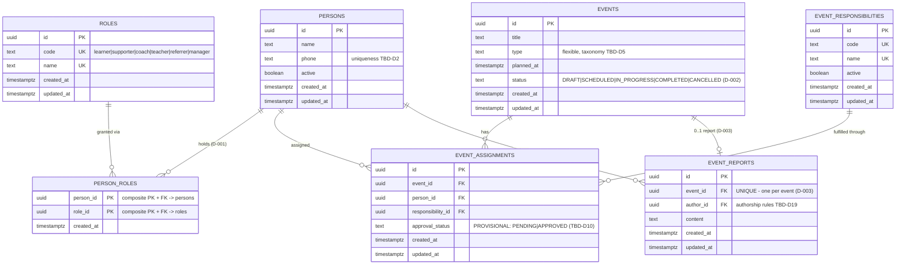

# 03 — Database Schema Design

**Project:** Ketabdaneh
**Document status:** Design artifact for future PostgreSQL implementation — NOT implemented. No tables, migrations, or SQL exist yet.
**Last reviewed:** 2026-09-09
**Depends on:** [00-PROJECT-CONTEXT.md](00-PROJECT-CONTEXT.md), [01-ARCHITECTURE.md](01-ARCHITECTURE.md), [02-DOMAIN-MODEL.md](02-DOMAIN-MODEL.md) (approved decisions D-001/D-002/D-003 are authoritative)

---

## 1. Purpose

Translate the approved conceptual domain model into a concrete, reviewable
**PostgreSQL relational schema design**. This document is the blueprint that a
future implementation task (SQLAlchemy models + Alembic migrations) will
follow after review.

**Design rule:** only approved business rules (02-DOMAIN-MODEL §1.1) and
confirmed concepts are encoded. Unresolved domain questions stay **TBD** and
are deliberately NOT encoded as schema constraints. Technical choices that are
purely schema-level (ID type, timestamp policy) are decided here and labeled
as such.

---

## 2. Schema Principles

1. **Normalized relational design** — no comma-separated strings, no JSON
   arrays where a relationship expresses the concept.
2. **Domain roles are separate from event responsibilities** — two distinct
   tables; they are different domain concepts (02-DOMAIN-MODEL §2.3).
3. **Approved business rules encoded** — D-001 (multi-role via join table),
   D-002 (exact status set), D-003 (≤ 1 report per event).
4. **Unresolved business rules not encoded prematurely** — e.g., no approval
   enum, no transition-matrix constraints, no role-based assignment
   restrictions in the schema.
5. **Foreign keys for integrity** — every relationship is an explicit FK.
6. **Minimal justified constraints** — each non-obvious constraint has a
   stated reason; nothing exists "because it's possible".
7. **Flexible areas are data, not speculative enums** — event types and
   event responsibilities are table rows (or constrained text), not DB enums,
   because their taxonomies remain TBD.

---

## 3. ID Strategy

| Choice | Value |
| --- | --- |
| ID type | **UUID** (`uuid` in PostgreSQL, stored as 16-byte native UUID) |
| Generation | **Application-generated UUIDv4** (or UUIDv7 if the ORM supports it at implementation time) — decided at implementation; not implemented here |
| Why | (a) IDs are opaque — no business meaning leak; (b) safe to generate client/application-side, useful for future offline/sync scenarios; (c) no cross-table sequence collisions; (d) avoids exposing counts/enumeration that serial integers imply. The repository architecture (single FastAPI monolith + PostgreSQL) gives no strong reason for integer serials. |

Trade-off noted: UUIDs are wider (16 B) and slightly slower to index than
bigints — acceptable at single-branch scale.

## 4. Timestamp Policy

| Column | Meaning | Type | Policy |
| --- | --- | --- | --- |
| `created_at` | Audit: row creation | `timestamptz` | Set by DB default (`now()`), never updated |
| `updated_at` | Audit: last modification | `timestamptz` | Maintained by application/trigger (mechanism decided at implementation) |
| `planned_at` (events) | **Business** datetime — when the event is planned to occur | `timestamptz` | Timezone-aware, always |

- **All timestamps are timezone-aware** (`timestamptz`). Rationale: the
  application is bilingual Persian/English and future integrations may
  involve absolute instants; naive timestamps are a known source of bugs.
  Business datetimes (`planned_at`) are always instants, never bare dates.
- Audit timestamps (`created_at`/`updated_at`) are clearly separated from
  business datetime (`planned_at`) — an event "created Tuesday" is not the
  event "planned for Saturday 17:00".
- Whether events also need a **business duration** or **end time** is not a
  confirmed concept → **TBD-S15**.

---

## 5. MVP Tables

### 5.1 `persons`

A human member of the branch.

| Column | Type | Constraints | Notes |
| --- | --- | --- | --- |
| `id` | uuid | PK | See §3 |
| `name` | text | `NOT NULL` | Single free-text field. Exact structure (single vs. first/last) **TBD-D1** — a single `name` is the minimal non-committal choice |
| `phone` | text | — | Known concept. **Uniqueness TBD-D2** — deliberately NOT unique until confirmed |
| `active` | boolean | `NOT NULL DEFAULT true` | Known active/inactive concept. What "inactive" *implies* (may they be assigned?) is **TBD-D3** — no check constraints or triggers encode it |
| `created_at` | timestamptz | `NOT NULL DEFAULT now()` | Audit |
| `updated_at` | timestamptz | `NOT NULL DEFAULT now()` | Audit |

### 5.2 `roles`

Permanent organizational role definitions. Modeled as **data** (rows), not an
enum — the six known roles are seeded; the list is the confirmed set and no
unknown roles are added.

| Column | Type | Constraints | Notes |
| --- | --- | --- | --- |
| `id` | uuid | PK | |
| `code` | text | `NOT NULL UNIQUE` | Stable machine key: `learner`, `supporter`, `coach`, `teacher`, `referrer`, `manager` |
| `name` | text | `NOT NULL UNIQUE` | Display name (e.g., "Learner / Student") |
| `created_at` | timestamptz | `NOT NULL DEFAULT now()` | Audit |
| `updated_at` | timestamptz | `NOT NULL DEFAULT now()` | Audit |

Seed rows (exactly the six known roles — nothing more):

`learner` (Learner / Student), `supporter` (Supporter), `coach` (Coach),
`teacher` (Teacher), `referrer` (Referrer), `manager` (Manager).

### 5.3 `person_roles`

**Why normalized (D-001):** a Person may hold multiple simultaneous
permanent roles. Rejected alternatives:

- *comma-separated string / JSON array* — not queryable ("all supporters"),
  no FK integrity, no per-role metadata, violates normalization;
- *single role enum column* — cannot represent multiple roles at all.

A join table gives referential integrity, cheap queries, and room for
role-specific attributes later. The conceptual "set of roles" from
D-001 maps 1:1 to this structure — this *is* the resolution of TBD-D22 for
the MVP, at the schema level.

| Column | Type | Constraints | Notes |
| --- | --- | --- | --- |
| `person_id` | uuid | `NOT NULL`, FK → `persons(id) ON DELETE CASCADE` | A person's role memberships disappear with the person |
| `role_id` | uuid | `NOT NULL`, FK → `roles(id) ON DELETE RESTRICT` | Role definitions are reference data — deleting a role that people hold must be refused, not cascaded |
| `created_at` | timestamptz | `NOT NULL DEFAULT now()` | Audit: when this role was granted |

**PK / uniqueness:** `PRIMARY KEY (person_id, role_id)` — the same person
cannot hold the same role twice; duplicates of the *pair* are prevented by
the composite key (this is the "unique person-role pair" requirement).

*No `updated_at`:* a membership row is immutable (created, then deleted);
grant history is **not** a confirmed requirement — if role history becomes
one, that is a design change (**TBD-S1**).

### 5.4 `events`

A planned branch activity.

| Column | Type | Constraints | Notes |
| --- | --- | --- | --- |
| `id` | uuid | PK | |
| `title` | text | `NOT NULL` | Human label for the event; confirmed need for events to be identifiable (minimal, not a business-rule invention) |
| `type` | text | `NOT NULL` | Flexible representation — see §6.2 |
| `planned_at` | timestamptz | `NOT NULL` | Business datetime (§4) |
| `status` | text | `NOT NULL DEFAULT 'DRAFT'`, `CHECK (status IN ('DRAFT','SCHEDULED','IN_PROGRESS','COMPLETED','CANCELLED'))` | Exact approved set (D-002); representation choice in §6.1 |
| `created_at` | timestamptz | `NOT NULL DEFAULT now()` | Audit |
| `updated_at` | timestamptz | `NOT NULL DEFAULT now()` | Audit |

### 5.5 `event_responsibilities`

Reusable definitions of operational responsibilities for events. **Data, not
an enum** (taxonomy TBD-D9): ~~known example rows are seedable~~
**[RESOLVED for the MVP — D-004]**: the six documented examples are seeded
by migration `0003` (docs/05 §5b) —
`pre_introduction`, `welcome_reception`, `technique_execution`,
`persuasion`, `registration`, `follow_up` — and the set can grow without a
schema change. Responsibilities are defined **once** here and referenced by
`event_assignments`, instead of duplicated as arbitrary strings per
assignment.

| Column | Type | Constraints | Notes |
| --- | --- | --- | --- |
| `id` | uuid | PK | |
| `code` | text | `NOT NULL UNIQUE` | Stable machine key |
| `name` | text | `NOT NULL UNIQUE` | Display name |
| `active` | boolean | `NOT NULL DEFAULT true` | Allows retiring a responsibility from *future* assignments without breaking history. Lifecycle details (retire/reactivate rules) → **TBD-S2** |
| `created_at` | timestamptz | `NOT NULL DEFAULT now()` | Audit |
| `updated_at` | timestamptz | `NOT NULL DEFAULT now()` | Audit |

### 5.6 `event_assignments`

The relationship: a **Person** performs an **EventResponsibility** for a
specific **Event**.

| Column | Type | Constraints | Notes |
| --- | --- | --- | --- |
| `id` | uuid | PK | |
| `event_id` | uuid | `NOT NULL`, FK → `events(id) ON DELETE CASCADE` | Assignments of a deleted event disappear with it |
| `person_id` | uuid | `NOT NULL`, FK → `persons(id) ON DELETE CASCADE` | A person's assignments disappear with the person |
| `responsibility_id` | uuid | `NOT NULL`, FK → `event_responsibilities(id) ON DELETE RESTRICT` | Reference data — must not be deleted while referenced |
| `approval_status` | text | `NOT NULL DEFAULT 'PENDING'`, `CHECK (approval_status IN ('PENDING','APPROVED'))` — **PROVISIONAL** (see below) | |
| `created_at` | timestamptz | `NOT NULL DEFAULT now()` | Audit |
| `updated_at` | timestamptz | `NOT NULL DEFAULT now()` | Audit |

**Existence vs approval — clearly separated:**

- **Assignment existence** = the row itself. Creating the row means "this
  person is assigned this responsibility for this event".
- **Assignment approval** = the `approval_status` column, an *attribute* of
  the assignment. The manager's confirmed need to approve assignments
  (02-DOMAIN-MODEL rule 1) is represented without making approval a
  prerequisite for existence.

**Provisional approval values (explicitly labeled):** the exact approval
states are **TBD-D10/A6** and are NOT decided. The `('PENDING','APPROVED')`
set is a **provisional design placeholder** chosen because (a) the manager's
approval need is confirmed, (b) a nullable/absent column would blur the
existence-vs-approval distinction, and (c) a two-value starting point with a
CHECK constraint can be widened (e.g., add `'REJECTED'`, `'DECLINED'`) by a
simple migration when the real states are decided — nothing in the design
blocks the future decision. The column is deliberately a text CHECK, not a
DB enum, for exactly that reason. **No approval workflow, approver identity,
or transition rules are encoded** — all TBD (D-10, A-6, S-13).

**Not encoded (unconfirmed):** exclusivity of a responsibility per event
(TBD-D11 — so there is **no unique constraint** on
`(event_id, responsibility_id)`); role-based restrictions on who may hold a
responsibility (TBD-D8); whether an inactive person may be assigned (TBD-D3).

### 5.7 `event_reports`

The optional post-event report (D-003).

| Column | Type | Constraints | Notes |
| --- | --- | --- | --- |
| `id` | uuid | PK | |
| `event_id` | uuid | `NOT NULL`, FK → `events(id) ON DELETE CASCADE`, **`UNIQUE`** | The UNIQUE constraint on `event_id` enforces **Event 1 → 0..1 EventReport** (D-003) at the database level |
| `author_id` | uuid | `NOT NULL`, FK → `persons(id) ON DELETE RESTRICT` | Conceptual field (design candidate). Who may author is **TBD-D19**; whether it must be an assignee is unknown — RESTRICT chosen so report history is not silently lost when a person row is removed; revisit with D19 |
| `content` | text | `NOT NULL` | Minimal representation. Exact structure (free text vs. structured/attendance) is **TBD-A9** |
| `created_at` | timestamptz | `NOT NULL DEFAULT now()` | Audit |
| `updated_at` | timestamptz | `NOT NULL DEFAULT now()` | Audit |

Report is **not mandatory**: the constraint is on *at most one per event*,
never "event must have a report" (that would contradict D-003).

---

## 6. Representation Decisions

### 6.1 Event status — text + CHECK (chosen) vs PostgreSQL ENUM

**Chosen: `text` column + `CHECK` constraint.**

| | ENUM | text + CHECK |
| --- | --- | --- |
| Approved status set (D-002) | Encodable | Encodable |
| Adding/removing a status later | `ALTER TYPE ... ADD VALUE` (awkward: cannot remove, cannot run inside a transaction in older PGs) | Simple migration (drop/recreate CHECK) |
| Application mapping | Needs Python-side enum kept in sync | Straightforward |
| Storage/JOIN behavior | Slightly more compact | Wider, uniformly simple |

Reason: the status **set** is approved for the MVP but explicitly revisitable
("may be revised later if the real business requires it"). A CHECK constraint
is the lower-blast-radius way to keep the database honest while D-002 can
still evolve. This is a **technical schema choice made here**, not a domain
decision — the allowed *transitions* (TBD-D7/D23) remain TBD and are NOT
encoded (no triggers/constraints on transitions).

### 6.2 Event type — flexible representation (taxonomy TBD-D5)

**Chosen: `text NOT NULL` with no CHECK constraint** (validated at the
application layer).

Trade-off: unlike `roles`/`event_responsibilities`, event type is **not** a
reusable referenced entity — it is a per-event label, the known examples
(introduction session, film analysis, book analysis, gathering, group games,
class) are not final, and no other table references it. A dedicated
`event_types` table would be a speculative taxonomy lock-in; a DB enum would
be worse (migration per taxonomy change). Free text keeps every option open:
when the taxonomy is decided (D-5), migrating to a reference table or adding
a CHECK is a straightforward, backward-compatible change from a text column.

Cost acknowledged: the DB will not reject unknown type strings until then —
the application validates against the current known list. The alternative
(an enum/table now) would encode an unapproved taxonomy, which violates the
design rule.

### 6.3 Event responsibility — data table (taxonomy TBD-D9, initial set seeded per D-004)

`event_responsibilities` is a first-class reference table (rows, not enum):
responsibilities are reused across events and assignments, they need display
names plus machine codes, and their taxonomy is TBD. This mirrors the roles
approach: **flexible areas are data**.

---

## 7. Foreign-Key Summary and Delete Behavior

| FK | Relationship | Delete behavior | Rationale |
| --- | --- | --- | --- |
| `person_roles.person_id` → `persons.id` | membership in a role | **CASCADE** | A person's role memberships are meaningless without the person |
| `person_roles.role_id` → `roles.id` | reference to definition | **RESTRICT** | Reference data in active use must not be deletable |
| `event_assignments.event_id` → `events.id` | assignment for an event | **CASCADE** | Assignments cannot exist without their event |
| `event_assignments.person_id` → `persons.id` | assignee | **CASCADE** | Assignment rows are operational links, not records to preserve — a deleted person's assignments go with them |
| `event_assignments.responsibility_id` → `event_responsibilities.id` | reference to definition | **RESTRICT** | Reference data; history must not silently break |
| `event_reports.event_id` → `events.id` | report of an event | **CASCADE** | A report without its event has no meaning |
| `event_reports.author_id` → `persons.id` | who wrote it | **RESTRICT** | A report is a record with audit value; deleting its author should be refused, not silently rewritten. **Provisional** — revisit when authorship rules (D19) are decided |

**Note:** "deleting a person" here is a hard delete of a member row. Whether
the business ever wants hard deletes of persons at all (vs. `active=false`)
is itself unconfirmed → **TBD-S3**. The behaviors above are the safe
relational defaults *if* deletion happens; they are not an approval of
deleting people.

---

## 8. Constraints and Indexes (justified only)

| Table | Constraint / index | Justification |
| --- | --- | --- |
| all | `PRIMARY KEY (id)` | Identity |
| `roles` | `UNIQUE (code)`, `UNIQUE (name)` | Reference-data integrity; no duplicate role definitions |
| `event_responsibilities` | `UNIQUE (code)`, `UNIQUE (name)` | Same |
| `person_roles` | `PRIMARY KEY (person_id, role_id)` | Prevents duplicate pair; doubles as the index for "roles of a person" lookups |
| `person_roles` | index on `(role_id)` | FK support and "all people with role X" queries (e.g., all supporters) — PK covers person_id lookups, not role_id |
| `events` | `CHECK (status IN (…5 approved values…))` | D-002 |
| `events` | index on `(planned_at)` | Calendar view and "events of a week" — the primary read pattern of the MVP workflow |
| `events` | index on `(status)` | Dashboard/visibility filtering by status. Low-cardinality — justified only because status filtering is a confirmed manager need; combined `(status, planned_at)` may replace it later (implementation detail) |
| `event_assignments` | index on `(event_id)` | "Assignments of an event" — the read pattern of the MVP workflow |
| `event_assignments` | index on `(person_id)` | "A person's assignments" (supporter-facing views) |
| `event_assignments` | index on `(responsibility_id)` | FK support (RESTRICT needs it) |
| `event_assignments` | `CHECK (approval_status IN ('PENDING','APPROVED'))` | Provisional placeholder (§5.6) |
| `event_reports` | `UNIQUE (event_id)` | **D-003 enforcement** — at most one report per event |
| `event_reports` | index on `(author_id)` | FK support (RESTRICT) |

Deliberately **absent** (with reasons):

- No `UNIQUE (event_id, responsibility_id)` on assignments — exclusivity is TBD-D11.
- No uniqueness on `persons.phone` — TBD-D2.
- No constraint tying assignment to person active/inactive — TBD-D3.
- No transition constraints on `events.status` — TBD-D7/D23.
- No indexes on `roles.name` / low-traffic columns beyond the above — tiny
  reference tables; uniqueness already indexes them.

---

## 9. Audit Fields Policy

- Every table carries `created_at`; mutable business tables also carry
  `updated_at` (see §4). `person_roles` intentionally has only `created_at`
  (immutable membership rows — §5.3).
- **Not added (unconfirmed, future/TBD):** `deleted_at` (no soft-delete
  requirement — see §10), `created_by`, `approved_by`, `cancelled_by`,
  `reported_at`. None of these correspond to confirmed requirements; they
  would encode workflow facts (who did what) that remain TBD. When
  assignment-approval design lands (D-10/A-6), an `approved_by`/`approved_at`
  on `event_assignments` is the natural addition — noted as future work,
  not designed now.

## 10. Soft Delete — Rejected

No soft delete (`deleted_at` / `is_deleted`) in the MVP schema. Reasons: no
confirmed requirement; it complicates every query and unique constraint; and
the one confirmed "removal-ish" concept — person active/inactive — is already
represented by `persons.active`. If archival requirements emerge, introduce
them deliberately then (**TBD-S3**).

---

## 11. Mermaid ER Diagram (MVP)

Cardinalities: `PERSONS ||--o{ PERSON_ROLES }o--|| ROLES` (many-to-many);
`EVENTS ||--o| EVENT_REPORTS` (zero-or-one); `EVENTS ||--o{
EVENT_ASSIGNMENTS }o--|| PERSONS/EVENT_RESPONSIBILITIES`.

---

## 12. Domain Concept → Table Mapping

| Domain concept | Table(s) | Notes |
| --- | --- | --- |
| Person | `persons` | |
| Role (permanent organizational) | `roles` + `person_roles` | D-001: the many-to-many *is* the set-of-roles concept |
| Event | `events` | Status per D-002; type kept flexible |
| EventAssignment | `event_assignments` | Existence = row; approval = attribute |
| EventResponsibility | `event_responsibilities` | Separate from roles by design |
| EventReport | `event_reports` | UNIQUE(event_id) enforces D-003 |
| Task | — deferred — | See §13 |
| Availability | — deferred — | See §13 |

## 13. Deferred Schema Concepts

**Task** and **Availability** are known domain concepts but are **deferred
from the first schema implementation**:

- They are **not part of the first approved workflow** (Create Event → Assign
  → Calendar → Complete → Record Result → Manager sees result).
- Their semantics carry the heaviest unresolved TBD load: Task
  lifecycle/approval (D-12, D-13, A-10), event↔task linkage (D-14);
  Availability recurring/week-scoped/mandatory/conflict semantics (D-15–D-18,
  A-3/A-4).
- Designing tables now would mean inventing answers to those TBDs — exactly
  what this schema must not do.

Future *direction* (not design): Task will likely need its own table with an
assignee FK → `persons.id` and a cadence concept; Availability likewise with
a supporter FK and a time-slot representation. Both will reference `persons`,
which is already designed to support them.

## 14. Database-Specific TBD Registry

Unresolved **domain** decisions remain unresolved; only purely technical
schema choices are decided in this document (IDs §3, timestamps §4, status
representation §6.1, event-type flexibility §6.2, delete behaviors §7 — all
labeled technical choices above).

| # | Question |
| --- | --- |
| TBD-S1 | Role membership history (grant/revoke tracking) — none designed |
| TBD-S2 | Responsibility lifecycle: retire/reactivate rules, archiving |
| TBD-S3 | Hard-delete policy for persons (vs `active=false`); archival requirements |
| TBD-S13 | Assignment approval: approver identity, `approved_by`/`approved_at`, workflow |
| TBD-S15 | Event end-time/duration — is it a confirmed concept? |
| TBD-D1 | Person name structure (schema uses one `name` field minimally) |
| TBD-D2 | Phone uniqueness (no unique constraint yet) |
| TBD-D3 | Inactive-person assignment behavior (not encoded) |
| TBD-D5 | Event type taxonomy (kept flexible) |
| TBD-D6 | Event recurrence modeling |
| TBD-D7 / TBD-D23 | Status transition matrix and authorization (not encoded) |
| TBD-D8 | Role-based restrictions on responsibilities (not encoded) |
| ~~TBD-D9: Final responsibility taxonomy (kept as data)~~ | **partially resolved by D-004**: initial six-row seed via migration `0003`; runtime creation of responsibilities remains open |
| TBD-D10 / TBD-A6 | Assignment approval states and scope — `approval_status` values are PROVISIONAL |
| TBD-D11 | Responsibility exclusivity per event (no unique constraint) |
| TBD-D19 | Report authorship/edit permissions (`author_id` semantics provisional) |
| TBD-D21 | Manager acknowledgement of reports (no field designed) |
| TBD-A9 | Report content structure (single `content` text is minimal) |
| Task schema | Entirely deferred (§13) |
| Availability schema | Entirely deferred (§13) |

## 15. Out of Scope for This Document

Implementation of any of the above: no SQL, no migrations, no SQLAlchemy, no
Alembic, no Docker/PostgreSQL changes, no API, no auth, no frontend. This
document is the review artifact for the future implementation task.
